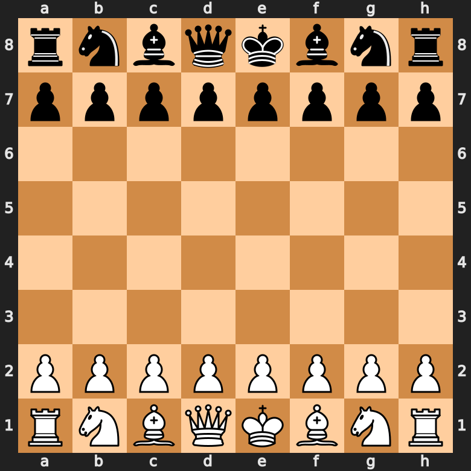

# README - Compilateur de partie d'échecs

Ce projet vise à appliquer les divers procédés de compilation à un langage de description de partie d'échecs.

## Fonctionnement du langage


Pour rappel, voici l'organisation du plateau avec l'appellation des colones(lettres) et des rangs(chiffres) : 



Les coups sont divisés en deux parties distinctes, séparées par un espace au minimum.
Le premier sert à identifier la pièce jouée, tandis que la deuxième désigne le coup effectué avec la case visée et, s'il y en a, l'action/les actions de ce coup, séparées par des tirets.

Déplacement : pion-d6 d7; (On précise toujours la rangée et la colone pour chaque pièce choisie)

Capture  : reine e3-capture (les actions effectuées par la pièce doivent être mentionnées, ainsi on suit la case d'arrivée d'un tiret suivie de l'action. S'il y a une action en plus, on suit la précédente action d'un autre tiret. exemple : reine e5-capture-echec)

## Les différentes actions lors d'un mouvement:

Capture            : pion-e5 d6-capture

Petit roque        : roi-e1 g1-petit_roque 

Grand roque        : roi-e1 c1-grand_roque

Echec au roi       : fou-f4 d6-echec

Echec et mat       : pion-a6 a7-checkmate

nul                : cavalier-g3 f5-nul

Promotion          : pion-b7 b8-p_reine (possible pour fou, tour et cavalier aussi)

## Règles d'écritures

Tous les coups sont séparés par des ';'. Il n'est pas obligatoire de passer à la prochaine ligne après un ';'. Les commentaires sont égalemen disponibles en les précédants d'un '//'.

L'utilisateur doit débuter ses coups par la couleur des pions du joueur les effectuant pour mieux s'y retrouver :
```
B : cavalier d3;
N : pion-e6 e8;
B : pion-f2 g3-capture;
...
```
Enfin, toute partie doit se terminer par le mot-clé "Endgame" suivi d'un ';'

Le dernier coup joué doit avoir soit la mention 'checkmate', soit la mention 'nul', et toute partie doit se terminer par le mot-clé "Endgame" suivi d'un ';'.
```
B : cavalier d3;
N : pion-e6 e8;
B : pion-f2 g3-capture-checkmate;
Endgame;
```
Des exemples de parties sont disponibles dans le dossier 'games/'

## Utilisation
Le fichier à appeler est le fichier exe, le terminal devant être dans le même répertoire que ce dernier :
```
python exe.py [options] [source file]
Options:
    -h,--help      show this help message
    -s,--start     start the chess game
    -t,--token     show token list
    -p,--pretty    show and output pretty code
```

Ne pas oublier d'installer les modules nécessaires avec la commande suivante :
```
pip install -r requirements.txt
```
Lorsque la partie est lancée, l'utilisateur peut avancer dans la partie avec la souris, la touche "espace" ou la touche "entrer".
